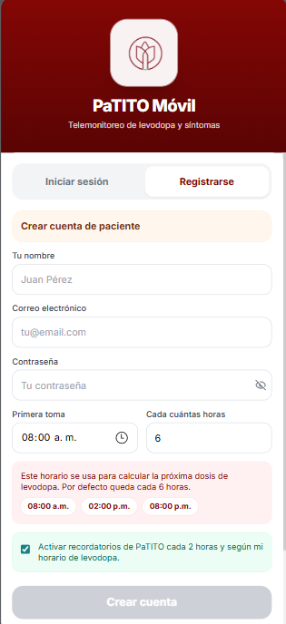
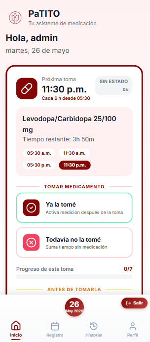

# PaTITO Móvil

**PaTITO Móvil** es una aplicación híbrida para el telemonitoreo de pacientes con enfermedad de Parkinson que toman levodopa.

Permite registrar tomas de medicamento, estados ON/OFF, síntomas, ejercicios motores, prueba de acelerómetro, historial diario, calendario, acceso biométrico y recordatorios locales.

> Proyecto académico. No sustituye valoración médica.

---

## Características principales

- Registro e inicio de sesión de paciente.
- Validación de correo electrónico.
- Guardado de sesión mediante token.
- Acceso biométrico en Android cuando existe sesión guardada.
- Configuración de horario de levodopa.
- Cálculo de próxima toma.
- Registro de toma de medicamento:
  - **ON**: el paciente ya tomó medicamento.
  - **OFF**: el paciente aún no tomó medicamento.
- Registro de síntomas antes y después de la toma.
- Ejercicio motor tipo tapping.
- Prueba rápida con acelerómetro.
- Historial con línea del tiempo.
- Calendario por día.
- Perfil con configuración de medicación.
- Recordatorios locales cada 2 horas.
- Notificaciones de medicación con identidad visual de PaTITO.
- App híbrida instalada en Android mediante Capacitor.

---

## Capturas de pantalla

<p align="center">
  
  
  
</p>

---

## Tecnologías

### App paciente

- Vue 3
- TypeScript
- Composition API
- Quasar Framework
- Tailwind CSS
- Pinia
- Capacitor
- Android Studio

### Plugins nativos

- Capacitor Preferences
- Capacitor Local Notifications
- Capacitor Network
- Biometric Auth
- Capacitor Motion / sensores móviles

### Backend

- Node.js
- Express
- TypeScript
- PostgreSQL / Supabase
- JWT
- bcrypt
- CORS

---

## Estructura del proyecto

```txt
project_monitoreo/
│
├── README.md
│
├── docs/
│   ├── 01-login.png
│   ├── 02-registro.png
│   └── 03-home.png
│
├── app-paciente/
│   ├── src/
│   ├── android/
│   ├── capacitor.config.json
│   └── package.json
│
├── backend/
│   ├── src/
│   ├── dist/
│   └── package.json
│
└── .gitignore
