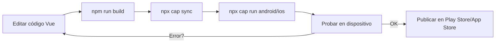

# 📱 Guía de Capacitor para App Móvil

## ¿Qué es Capacitor?

Capacitor es un framework que convierte tu app web Vue (que ya funciona en navegador) en **apps nativas para iOS y Android**. Funciona como un "envoltorio" que permite acceder a APIs nativas del teléfono.

---

## 🚀 Paso 1: Instalar Capacitor

```bash
npm install @capacitor/core @capacitor/cli
```

---

## 🔧 Paso 2: Inicializar Capacitor

```bash
npx cap init
```

Te pedirá:
- **App name:** `app-paciente` (o el nombre que quieras)
- **App Package ID:** `com.paciente.app` (identificador único)
- **Web dir:** `dist` (carpeta de build de Vue)

Esto crea dos carpetas nuevas:
- `android/` - Proyecto Android Studio
- `ios/` - Proyecto Xcode

---

## 📦 Paso 3: Build tu app Vue

Antes de sincronizar, debes compilar Vue para que genere la carpeta `dist/`:

```bash
npm run build
```

---

## 🔄 Paso 4: Sincronizar archivos

```bash
npx cap sync
```

Este comando:
- Copia tu código compilado (dist/) a las apps nativas
- Instala plugins necesarios
- Actualiza dependencias

---

## 📱 Paso 5: Abrir en Android Studio (Android)

### Requisitos previos:
- Descargar Android Studio: https://developer.android.com/studio
- Tener JDK 11+ instalado

### Comando para abrir:

```bash
npx cap open android
```

Esto abrirá Android Studio con tu proyecto listo para compilar.

**Para correr en emulador:**
1. En Android Studio: `Build > Build Bundle(s) / APK(s)`
2. O en terminal: `npx cap run android`

---

## 🍎 Paso 6: Abrir en Xcode (iOS)

### Requisitos previos:
- Solo en macOS
- Tener Xcode instalado

### Comando para abrir:

```bash
npx cap open ios
```

Xcode se abrirá con tu proyecto. Puedes correr en simulador o dispositivo físico.

---

## 🧪 Paso 7: Probar cambios rápidamente

### Opción A: Desarrollo web (más rápido)
```bash
npm run dev
```
Accede desde navegador: `http://localhost:5174/`

### Opción B: Probar cambios en dispositivo/emulador
```bash
npm run build
npx cap sync
npx cap run android   # o npx cap run ios
```

---

## 🎯 Flujo de desarrollo típico



---

## 🔌 Usando APIs nativas (ejemplo: Cámara)

Si quieres acceder a la cámara del teléfono desde Vue:

### 1. Instalar plugin de cámara:
```bash
npm install @capacitor/camera
npx cap sync
```

### 2. Usar en Vue:
```typescript
import { Camera, CameraResultType } from '@capacitor/camera'

const takePhoto = async () => {
  const image = await Camera.getPhoto({
    quality: 90,
    allowEditing: false,
    resultType: CameraResultType.Uri
  })
  console.log('Foto:', image.webPath)
}
```

---

## 📂 Estructura del proyecto después de Capacitor

```
app-paciente/
├── src/              (Tu código Vue)
├── dist/             (Build compilado)
├── android/          (Proyecto Android - NO editar directo)
├── ios/              (Proyecto iOS - NO editar directo)
├── capacitor.config.ts
└── package.json
```

**⚠️ Importante:** 
- NO edites archivos en `android/` o `ios/` directamente
- Haz cambios en `src/`, luego `npm run build` → `npx cap sync`

---

## ✅ Checklist rápido

- [ ] `npm install @capacitor/core @capacitor/cli`
- [ ] `npx cap init`
- [ ] `npm run build`
- [ ] `npx cap sync`
- [ ] `npx cap open android` (o `ios`)
- [ ] Compilar y probar en emulador/dispositivo

---

## 🆘 Troubleshooting

### Error: "dist folder not found"
```bash
npm run build  # Genera la carpeta dist/
npx cap sync
```

### Error en Android Studio: "JDK not found"
- Descarga JDK 11+: https://www.oracle.com/java/technologies/downloads/
- En Android Studio: File > Project Structure > JDK location

### App no actualiza cambios
```bash
npm run build
npx cap sync     # Copia cambios
npx cap run android  # Recompila en emulador
```

---

## 📚 Recursos útiles

- Docs oficial: https://capacitorjs.com/docs
- Plugins disponibles: https://capacitorjs.com/docs/plugins
- Community: https://discord.gg/capacitorjs
